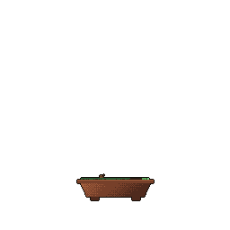

# Hi there!  I am Manjeet Chugh  

  
  &nbsp;&nbsp;&nbsp;&nbsp;
  

 
Meet <strong>Typo</strong> my pixelated mischief-maker, prowling through my README and leaving a little chaos in his wake.
<picture>
  <source
    media="(prefers-color-scheme: dark)"
    srcset="https://raw.githubusercontent.com/manjeetchugh/manjeetchugh/master/dist/pet.svg"
  >
  <source
    media="(prefers-color-scheme: light)"
    srcset="https://raw.githubusercontent.com/manjeetchugh/manjeetchugh/master/dist/pet-light.svg"
  >
  
</picture>
 

###  About Me
- 🎓 B.Tech student in **Electronics and Communication** Engineering (AI & IoT)  
- 🤖 Exploring **AI**, embedded systems, and open source  
- 🌱 Learning **C** and **Python** by building projects 
---

### 🛠️ Languages & Tools

  

---

###  My GitHub Stats
<table cellspacing="0"> <tr> <td align="center" valign="middle">
  

    

   

  
  

</td>

<td align="center" valign="middle">

  

    

   

  
  

</td>

</tr> </table>
 

### ⏳ Year Progress

**{ ███████████████████████▁▁▁▁▁▁▁ } 76.75%**

As of ⏰ 8-Oct-2026

 

###  My Contribution Graph

<picture>
  <source
    media="(prefers-color-scheme: dark)"
    srcset="https://raw.githubusercontent.com/manjeetchugh/manjeetchugh/master/dist/graph.svg"
  >
  <source
    media="(prefers-color-scheme: light)"
    srcset="https://raw.githubusercontent.com/manjeetchugh/manjeetchugh/master/dist/graph-light.svg"
  >
  
</picture>
 

---

###  A Quote to Think About

<a href="https://github.com/marketplace/actions/quote-readme">
<!--STARTS_HERE_QUOTE_README-->
<i>❝“It is easier to change the specification to fit the program than vice versa.”— Alan Perlis   ❞</i>
<!--ENDS_HERE_QUOTE_README-->
</a>
---

### 🎮 Outside of Coding

I enjoy playing table tennis, chess, and 8-ball pool. Feel free to connect for a game of chess!  

---

  <b>Thanks for stopping by! ✨</b>

  

